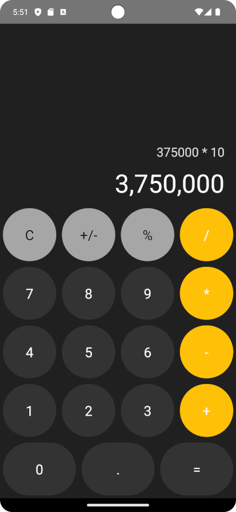

Este es un proyecto [**React Native**](https://reactnative.dev), usando [`@react-native-community/cli`](https://github.com/react-native-community/cli).

# 📄 Breve descripción de la aplicación

Esta elegante aplicación de calculadora facilita las matemáticas con una interfaz limpia y minimalista.
Admite aritmética estándar de una calculadora tradicional. La interfaz intuitiva y el diseño limpio facilitan el cálculo.
Desarrollado a partir de un ejemplo dado en freecodecamp. Sencilla pero potente calculadora desarrollada con React Native 📱.

# 📱 Captura de pantalla de la aplicación



# Primeros pasos

>**Nota**: Asegúrese de haber completado las instrucciones de [React Native - Environment Setup](https://reactnative.dev/docs/environment-setup) hasta el paso "Crear una nueva aplicación", antes de continuar.

## 🔵 Paso 1: Instalar

Configurar el entorno y las dependencias

```bash
# using npm
npm install

# OR using Yarn
yarn install
```

## 🔵 Paso 2: Iniciar el Metro Server

En primer lugar, tendrás que iniciar **Metro**, el _bundler_ de JavaScript que viene _con_ React Native.

Para iniciar Metro, ejecuta el siguiente comando desde el _root_ de tu proyecto React Native:

```bash
# using npm
npm start

# OR using Yarn
yarn start
```

## 🔵 Paso 3: Inicie su aplicaci&#243;n

Deja que Metro Bundler se ejecute en su _propia_ terminal. Abre un _nuevo_ terminal desde el _root_ de tu proyecto React Native. Ejecuta el siguiente comando para iniciar tu aplicación _Android_ o _iOS_:

### Para Android

```bash
# using npm
npm run android

# OR using Yarn
yarn android
```

### Para iOS

```bash
# using npm
npm run ios

# OR using Yarn
yarn ios
```

Si todo está configurado _correctamente_, usted debe ver su nueva aplicación que se ejecuta en su _Android Emulator_ o _iOS Simulator_ 
Brevemente, siempre que hayas configurado correctamente tu emulador/simulador.

If everything is set up _correctly_, you should see your new app running in your _Android Emulator_ or _iOS Simulator_ shortly provided you have set up your emulator/simulator correctly.

Esta es una forma de ejecutar tu aplicación - también puedes ejecutarla directamente desde Android Studio y Xcode respectivamente.

## 🚀 Enhorabuena! :tada:

Has ejecutado con éxito tu React Native App. :partying_face:
